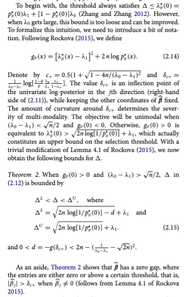

```{r}
library(tidyverse)
library(fastcmprsk, lib.loc = "/Library/Frameworks/R.framework/Versions/4.5-arm64/Resources/library")
library(survival)
```

```{r}
source("/Users/sophiehuebler/Documents/bhCRR/R/cv_ssl_psdh.r")
source("/Users/sophiehuebler/Documents/bhCRR/R/fit_ssl_psdh.r")
source("/Users/sophiehuebler/Documents/bhCRR/R/update_betas.r")
source("/Users/sophiehuebler/Documents/bhCRR/R/expected_inclusion_probs.r")
source("/Users/sophiehuebler/Documents/bhCRR/R/expected_penalty_weights.r")
source("/Users/sophiehuebler/Documents/bhCRR/R/update_mixture_prob.r")
source("/Users/sophiehuebler/Documents/bhCRR/R/helpers.r")
source("/Users/sophiehuebler/Documents/bhCRR/R/tune_ssl_psdh.r")
source("/Users/sophiehuebler/Documents/bhCRR/R/measure_ssl_psdh.r")
source("/Users/sophiehuebler/Documents/bhCRR/R/predict_from_ssl_psdh.r")
source("/Users/sophiehuebler/Documents/bhCRR/R/generate_foldid.r")
source("/Users/sophiehuebler/Documents/bhCRR/R/dedupe_warnings.r")
source("/Users/sophiehuebler/Documents/bhCRR/R/cv_fastCrrp.r")
```

# Framework:

Consider the clinTALL genome study that investigated 1362 children with childhood T-lineage acute lymphoblastic leukemia, of whom 61 underwent HSCT. There were 19 deaths in this group. Causes of death in this group include the primary disease, transplant related complications, and other complications.

Prior work with the larger dataset (<https://www.biorxiv.org/content/10.64898/2026.01.28.701965v1.full>) showed that deep learning models trained on the gene expression data for risk stratification had nearly perfect separation for induction failure. Induction failure is associated with death from the primary disease. However, risk stratification was not nearly as accurate for other failure types. One potential explanation for this is that post transplantation complications like GVHD have been shown to be associated with the microbiome, so deaths from this category may be primarily driven by alternate but correlated phenomenon.

Let us make the fairly reasonable assumption that the relationships between gene expression and induction failure and between induction failure and death by primary disease hold in this HSCT subpopulation as it did in the larger population.

Our goal is to use the HSCT cohort to identify specific associations between gene expression and time to death by the primary disease. This could be useful in developing therapeutic targets or investigating disease mechanisms down the line. Particularly if the associations with gene expression turn out to be causal.

In high dimensional setting, while it is unrealistic to assume proportional hazards holds, proportional hazards models can still be useful to identify the main effects of individual factors. However, we have competing risks from transplant complications, and we have reason to believe that these event times for are governed more strongly by other factors like the microbiome. The microbiome is unobserved, and not necessarily independent from gene expression data, but we do not expect the relationship between gene expression data and transplant complications to be so straightforward. Specifically, rather than gene expression data having a causal relationship with transplant outcomes, we think it is more likely that the starting point of the host microbiome might have a causal relationship with transplant outcomes, and also an associative or effect modifying relationship with gene expression data. In this way, we expect a proportional hazards model based on gene expression data to be extremely ill fitting for the transplant complications outcome.

-   We assume the assumption violations to be mild in the case of the primary event, and severe in the case of the competing event.

-   Under this scenario, it would not make sense to form multiple proportional hazard models for each event. Therefore, the potential issue with the cummulative CIF \> 1 that arises when fitting separate proportional subdistribution hazards models is not a problem here, because there is not a reason to fit a proportional subdistribution hazards model to the competing event.

-   Similarly, it would not make sense to try to fit 2 cause specific hazards models to the separate events.

This is an excellent case for a high dimensional competing risks model based on the proportional subdistribution hazards model. With this model, we are able to frame the problem focusing on death from the primary disease.

-   We acknowledging that there is likely to be bias that would arise by treating censored patients and patients who fail from transplant outcomes event identically, but we do not have the microbiome data to model the failure from transplant outcomes.

# Simulating Easy Scenarios:

We'll use the simulation tool from the fast comp risk package. The design matrix is simulated from a multivariate normal (0,1) in 5 dimensions. We make umin=umax for administrative censoring, and currently we don't allow censoring so we make it much larger than the event time.

```{r}
easy_sim <- function(nobs, beta1, beta2){
  sim <- simulateTwoCauseFineGrayModel(nobs = 50,
                                          beta1 = beta1,
                                          beta2 = beta2,
                                          X = NULL,
                                          u.min = 100,
                                          u.max = 100,
                                          p = 0.5,
                                          returnX = TRUE)
  
  sim_data <- cbind(data.frame(ID = nobs,
                            TTE = sim$ftime,
                            Status = as.integer(sim$fstatus)),
                       sim$X)
  
  names(sim_data)<- c("ID", "TTE", "Status", paste0("X_", 1:(ncol(sim_data)-3)))
  
  x <- as.matrix(sim_data %>%select(starts_with("X")))
  y <- as.matrix(sim_data %>%
  mutate(Status = as.numeric(Status))%>%
  select(TTE, Status))
  
  return(list("dataframe" = sim_data,
              "x" = x,
              "y" = y))
}
```

```{r}
set.seed(3149)
p5 <- easy_sim(50,
               c(0.40, - 0.50, 0.60, 0.75, - 0.80),
               c(0, 0.3, 0, 0, -0.2)
               )

p5_comparisons <- data.frame(Name = c("B1", "B2", "B3", "B4", "B5"),
                             True_beta = c(0.40, - 0.50, 0.60, 0.75, - 0.80))

p10 <- easy_sim(50,
               c(0.40, - 0.50, 0.60, 0.75, - 0.80, 0, 0, 0, 0, 0),
               c(0, 0.3, 0, 0, -0.2, 0, 0, 0, 0, 0)
               )

p10_comparisons <- data.frame(Name = c("B1", "B2", "B3", "B4", "B5", 
                                       "B6", "B7", "B8", "B9", "B10"),
                            True_beta = c(0.40, - 0.50, 0.60, 0.75, - 0.80, 0, 0, 0, 0, 0)
                            )
```

```{r}


ggplot(p5$dataframe, aes(x = TTE, group = as.factor(Status)))+
  geom_density(aes(color = as.factor(Status)))+
  scale_color_manual(name = "Failure",
                     labels = c("Primary",
                                "Competing"),
                     values = c("red", "blue"))+
  xlab("Time to Event")+
  ylab("Density")+
  ggtitle("P5 Scenario (5 active predictors)")

ggplot(p10$dataframe, aes(x = TTE, group = as.factor(Status)))+
  geom_density(aes(color = as.factor(Status)))+
  scale_color_manual(name = "Failure",
                     labels = c("Primary",
                                "Competing"),
                     values = c("red", "blue"))+
  xlab("Time to Event")+
  ylab("Density")+
  ggtitle("P10 Scenario (5 active predictors, 5 inactive predictors)")
```

# Functions

## Viz

```{r}
viz_comparison <- function(comp_df, viztype = "full"){
  if(viztype == "full"){
  df <- comp_df %>%
    pivot_longer(cols = -Name,
               names_to = "Model",
               values_to = "Estimate")%>%
  mutate(Model_Type = case_when(Model %in% c("True_beta", "Fg") ~ Model,
                                Model %in% c("fstcmp_minPenalty",
                                             "fstcmp_normalTuned",
                                             "fstcmp_wolbersTuned") ~ "FastCmp",
                                Model %in% c("ssl_minPenalty",
                                             "ssl_normalTuned",
                                             "ssl_wolbersTuned")~ "SSL"))%>%
  mutate(Tuning_Type = case_when(Model %in% c("True_beta", "Fg") ~ "None",
                                 Model %in% c("fstcmp_minPenalty",
                                              "ssl_minPenalty") ~ "Known Sparsity",
                                Model %in% c("fstcmp_normalTuned",
                                             "ssl_normalTuned") ~ "C-index",
                                Model %in% c("ssl_wolbersTuned",
                                             "fstcmp_wolbersTuned")~ "Wolbers")) %>%
  mutate(Model = factor(Model,
                        levels = c("True_beta", "Fg",
                                  "fstcmp_minPenalty",
                                             "fstcmp_normalTuned",
                                             "fstcmp_wolbersTuned",
                                  "ssl_minPenalty",
                                             "ssl_normalTuned",
                                             "ssl_wolbersTuned"),
                        labels = c("True", "Fine-Gray",
                                   "FastCmp: Known Sparsity",
                                   "FastCmp: Cindex",
                                   "FastCmp: Wolbers",
                                   "SSL: Known Sparsity",
                                   "SSL: Cindex",
                                   "SSL: Wolbers")))
  
  true_vals <- df %>%
  filter(Model_Type == "True_beta") %>%
  select(Name, TrueValue = Estimate)

  p <- ggplot(df ,
       aes(x = Model, y = Estimate, color = Name)) +
  geom_point() +
  geom_hline(data = true_vals,
             aes(yintercept = TrueValue, color = Name),
             linetype = "dotted") +
  theme(axis.text.x = element_text(angle = 45, hjust = 1))
  }else if(viztype == "difference"){
   df <- comp_df %>%
  pivot_longer(cols = -c(Name, True_beta),
               names_to = "Model",
               values_to = "Estimate")%>%
  mutate(Model_Type = case_when(Model %in% c( "Fg") ~ Model,
                                Model %in% c("fstcmp_minPenalty",
                                             "fstcmp_normalTuned",
                                             "fstcmp_wolbersTuned") ~ "FastCmp",
                                Model %in% c("ssl_minPenalty",
                                             "ssl_normalTuned",
                                             "ssl_wolbersTuned")~ "SSL"))%>%
  mutate(Tuning_Type = case_when(Model %in% c( "Fg") ~ "None",
                                 Model %in% c("fstcmp_minPenalty",
                                              "ssl_minPenalty") ~ "Known Sparsity",
                                Model %in% c("fstcmp_normalTuned",
                                             "ssl_normalTuned") ~ "C-index",
                                Model %in% c("ssl_wolbersTuned",
                                             "fstcmp_wolbersTuned")~ "Wolbers")) %>%
  mutate(Model = factor(Model,
                        levels = c( "Fg",
                                  "fstcmp_minPenalty",
                                             "fstcmp_normalTuned",
                                             "fstcmp_wolbersTuned",
                                  "ssl_minPenalty",
                                             "ssl_normalTuned",
                                             "ssl_wolbersTuned"),
                        labels = c( "Fine-Gray",
                                   "FastCmp: Known Sparsity",
                                   "FastCmp: Cindex",
                                   "FastCmp: Wolbers",
                                   "SSL: Known Sparsity",
                                   "SSL: Cindex",
                                   "SSL: Wolbers")))%>%
  mutate(Error = True_beta -Estimate)
   
  p <-  ggplot(df, aes(x = Model, y = Error, color = Name))+
  geom_point()+
  theme(axis.text.x = element_text(angle = 45, hjust = 1))
  
  }
  
  p
}
```

## Outcomes

```{r}
calculate_metrics <- function(predicted, true_val) {
  
  # Replace NA values with 0 (assuming NA means the variable was not selected)
  predicted <- ifelse(is.na(predicted), 0, predicted)
  true_val <- ifelse(is.na(true_val), 0, true_val)
  
  # Determine selection status (non-zero coefficient means selected)
  pred_selected <- predicted != 0
  true_selected <- true_val != 0
  
  # Calculate Confusion Matrix elements
  TP <- sum(pred_selected & true_selected)
  TN <- sum(!pred_selected & !true_selected)
  FP <- sum(pred_selected & !true_selected)
  FN <- sum(!pred_selected & true_selected)
  
  # Calculate Metrics (with safeguards against division by zero)
  sensitivity <- ifelse((TP + FN) == 0, NA, TP / (TP + FN))
  specificity <- ifelse((TN + FP) == 0, NA, TN / (TN + FP))
  ppv <- ifelse((TP + FP) == 0, NA, TP / (TP + FP))
  
  # F1 Score: 2 * (Precision * Recall) / (Precision + Recall)
  # Note: PPV is Precision, Sensitivity is Recall
  f1 <- ifelse((ppv + sensitivity) == 0 | is.na(ppv) | is.na(sensitivity), 
               NA, 
               2 * (ppv * sensitivity) / (ppv + sensitivity))
  
  # Mean Squared Error
  mse <- mean((predicted - true_val)^2)
  
  # Return as a single-row dataframe
  return(data.frame(
    Sensitivity = sensitivity,
    Specificity = specificity,
    PPV = ppv,
    F1 = f1,
    MSE = mse
  ))
}

# Identify the columns that contain model predictions
# We exclude 'Name' and 'True_beta'
metrics_summary <- function(df){
model_cols <- setdiff(names(df), c("Name", "True_beta"))

# Apply the function to each model column and bind the results
results_list <- lapply(model_cols, function(model) {
  metrics <- calculate_metrics(df[[model]], df$True_beta)
  metrics$Model <- model
  return(metrics)
})

# Combine everything into a clean summary table
results_df <- bind_rows(results_list) %>%
  select(Model, Sensitivity, Specificity, PPV, F1, MSE) # Reorder columns for readability

results_df
}


```

# P5

## Fine and Gray

```{r}

# 1. Convert Status to a factor for the multi-state model.
# CRITICAL: 0 (censored) must be the first level.
p5$dataframe$Status_factor <- factor(p5$dataframe$Status, 
                           levels = c(0, 1, 2), 
                           labels = c("censor", "event", "competing"))

# 2. Restructure the dataset for the Fine-Gray model
# 'etype="event"' tells R that Status=1 is our risk of interest
p5_fg_data <- finegray(Surv(TTE, Status_factor) ~ ., data = p5$dataframe, etype = "event")

# 3. Fit the model using coxph()
# finegray() automatically creates 'fgstart', 'fgstop', 'fgstatus', and weights ('fgwt')
p5_fg_model <- coxph(Surv(fgstart, fgstop, fgstatus) ~ X_1 + X_2 + X_3 + X_4 + X_5, 
                  weight = fgwt, 
                  data = p5_fg_data)


```

```{r}
p5_comparisons$Fg = p5_fg_model$coefficients

p5_comparisons
```

## Fastcmprsk

### Known sparsity

We'll use the least penalized form of the model (lambda = 0.001).

```{r}


p5_fstcmp_minPenalty <- fastcmprsk::fastCrrp(
    Crisk(
      p5$y[,1],
      p5$y[,2],
      cencode = 0,
      failcode = 1
    ) ~ p5$x,
    penalty = "LASSO",
    lambda = 0.001
  )
```

```{r}
p5_comparisons$fstcmp_minPenalty = as.vector(p5_fstcmp_minPenalty$coef)

p5_comparisons
```

### Tuning

#### Normal C-index

This is straight from the survival package

```{r}

p5_fstcmp_normalTuned <- cv_fastCrrp(x = p5$x, time = p5$y[,1], status = p5$y[,2],
                            k = 5, penalty = "LASSO",
                            lambda = 10^seq(log10(0.1),log10(0.001),length = 25),
                            tuning = "normal")

# Extract your optimal lambda
p5_fstcmp_normalTuned_best_lambda <- p5_fstcmp_normalTuned$lambda_min


```

```{r}
p5_comparisons$fstcmp_normalTuned = as.vector(p5_fstcmp_normalTuned$full_model$coef[, 
                which(p5_fstcmp_normalTuned$lambda == p5_fstcmp_normalTuned_best_lambda)])

p5_comparisons
```

#### Wolbers C-index

This is the time dependent competing risks aware c-index. We are evaluating at the median of event times.

```{r}
p5_fstcmp_wolbersTuned <- cv_fastCrrp(x = p5$x, time = p5$y[,1], status = p5$y[,2],
                            k = 5, penalty = "LASSO",
                            lambda = 10^seq(log10(0.1),log10(0.001),length = 25),
                            tuning = "wolbers")
test_p5_fstcmp_wolbersTuned <- cv_fastCrrp_cpp(x = p5$x, time = p5$y[,1], status = p5$y[,2],
                            k = 5, penalty = "LASSO",
                            lambda = 10^seq(log10(0.1),log10(0.001),length = 25),
                            tuning = "wolbers")

# Extract your optimal lambda
p5_fstcmp_wolbersTuned_best_lambda <- p5_fstcmp_wolbersTuned$lambda_min

best_p5_lambda_mod <- fastcmprsk::fastCrrp(
    Crisk(
      p5$y[,1],
      p5$y[,2],
      cencode = 0,
      failcode = 1
    ) ~ p5$x,
    penalty = "LASSO",
    lambda = p5_fstcmp_wolbersTuned_best_lambda
  )
```

```{r}
p5_comparisons$fstcmp_wolbersTuned = as.vector(p5_fstcmp_wolbersTuned$full_model$coef[, 
                which(p5_fstcmp_wolbersTuned$lambda == p5_fstcmp_wolbersTuned_best_lambda)])

p5_comparisons
```

## SSL

### Known sparsity

Similarly, we'll use the least penalized form of the model. We could do this either by fixing the global shrinkage to that of what we saw in the fastcmprsk, or we can just set the hyperparameter scales to extreme values. We'll set the hyperparameter scales to extreme values here.

```{r}
p5_ssl_minPenalty <- fit_ssl_psdh(p5$x,p5$y, ss = c(0.001, 1))
```

```{r}

p5_comparisons$ssl_minPenalty = as.vector(p5_ssl_minPenalty$final_model_object$coef)

p5_comparisons
```

### Tuning

Now we'll say we have no idea about sparsity, so naively we'll place 0.5 (in future we can tune this?)

```{r}
psdh_ssl_func <- function(x, y, init_sparsity, ncv_count,
                          tuning = "wolbers",
                          s0_seq = seq(0.005, 0.1, length.out = 20),
                          s1_seq = seq(0.5,   0.9, length.out = 10),
                          nfolds = 10,
                          initial_shrinkage = NULL,
                          fixed_global_shrinkage = NULL,
                          save_tunes = NULL) {
  
  start_time <- Sys.time()
  x <- as.matrix(x)
  y <- as.matrix(y)
  fit <- fit_ssl_psdh(x, y, initial_sparsity = init_sparsity, fixed_global_shrinkage = fixed_global_shrinkage, initial_shrinkage = NULL)

  if (tuning == "wolbers") {
    tunes <- tryCatch(
      tune_ssl_psdh(fit,
                    s0_seq,
                    s1_seq,
                    ncv              = ncv_count,
                    initial_sparsity = init_sparsity),
      error = function(msg) NA
    )
  } else if (tuning == "normal") {
    # Manual grid search using standard Harrell C-index (survival::concordance)
    # on the SSL linear predictor x_test %*% beta. Folds shared across all
    # (s0, s1) pairs and pooled across folds before averaging over reps.
    n      <- nrow(y)
    fol    <- generate_foldid(nobs = n, nfolds = nfolds,
                              foldid = NULL, ncv = ncv_count)
    foldid <- fol$foldid

    param_grid <- expand.grid(s0 = s0_seq, s1 = s1_seq)
    valid_grid <- param_grid[param_grid$s1 > param_grid$s0, ]
    if (nrow(valid_grid) == 0) {
      stop("No valid (s0, s1) pairs with s1 > s0.")
    }

    results_list <- lapply(seq_len(nrow(valid_grid)), function(p) {
      s0_p <- valid_grid$s0[p]
      s1_p <- valid_grid$s1[p]

      pooled <- rep(NA_real_, ncv_count)
      for (rep_idx in seq_len(ncv_count)) {
        lp_all <- rep(NA_real_, n)
        for (f in seq_len(nfolds)) {
          omit_idx <- which(foldid[, rep_idx] == f)
          y_train  <- as.matrix(y[-omit_idx, ])
          x_train  <- as.matrix(x[-omit_idx, , drop = FALSE])

          sub_fit <- try(suppressWarnings(
            fit_ssl_psdh(x = x_train, y = y_train,
                         ss = c(s0_p, s1_p),
                         initial_sparsity = init_sparsity,
                         maxit = 50, epsilon = 1e-04,
                         fixed_global_shrinkage = fixed_global_shrinkage)
          ), silent = TRUE)
          if (inherits(sub_fit, "try-error")) next

          x_test <- x[omit_idx, , drop = FALSE]
          lp_all[omit_idx] <- as.vector(
            x_test %*% as.vector(sub_fit$final_model_object$coef)
          )
        }

        pooled[rep_idx] <- tryCatch(
          survival::concordance(
            Surv(y[, 1], y[, 2] == 1) ~ lp_all
          )$concordance,
          error = function(e) NA_real_
        )
      }

      c(s0         = s0_p,
        s1         = s1_p,
        score_mean = mean(pooled, na.rm = TRUE),
        score_sd   = if (ncv_count == 1) NA_real_ else sd(pooled, na.rm = TRUE))
    })

    tunes <- as.data.frame(do.call(rbind, results_list))
  } else {
    stop("`tuning` must be 'normal' or 'wolbers'.")
  }

  #print(head(tunes))
  max_tune <- tunes %>%
    dplyr::filter(score_mean == max(tunes$score_mean, na.rm = TRUE))
  
  if(!is.null(save_tunes)){
    assign(x = save_tunes, value = tunes, envir = .GlobalEnv)
  }


  final_fit <- fit_ssl_psdh(x, y,
                            ss = c(max_tune$s0[1], max_tune$s1[1]),
                            initial_sparsity = init_sparsity,
                            fixed_global_shrinkage = fixed_global_shrinkage)
  
  end_time <-Sys.time()
  print(end_time - start_time)

  final_fit
}
```

#### Normal C-index

```{r}
p5_ssl_normalTuned <- psdh_ssl_func( p5$x, p5$y, 0.5, 1,
                          tuning = "normal",
                          s0_seq = seq(0.003, 0.1, length.out = 5),
                          s1_seq = seq(0.5,   0.9, length.out =5),
                          nfolds = 10,
                          fixed_global_shrinkage = NULL,
                          save_tunes = "p5_ssl_normalTuned_tunes")
```

```{r}
p5_comparisons$ssl_normalTuned = as.vector(p5_ssl_normalTuned$final_model_object$coef)

p5_comparisons
```

#### Wolbers C-index

```{r}

p5_ssl_wolbersTuned <- psdh_ssl_func( p5$x, p5$y, 0.5, 1,
                          tuning = "wolbers",
                          s0_seq = seq(0.005, 0.1, length.out = 10),
                          s1_seq = seq(0.45,   0.9, length.out = 10),
                          nfolds = 10,
                          fixed_global_shrinkage = NULL,
                          save_tunes = "p5_ssl_wolbersTuned_tunes")
```

```{r}
p5_comparisons$ssl_wolbersTuned = as.vector(p5_ssl_wolbersTuned$final_model_object$coef)

p5_comparisons
```

```{r}
ggplot(p5_ssl_wolbersTuned_tunes, aes(x = as.factor(s1), y = as.factor(s0), fill = score_mean)) +
  geom_tile(color = "white") +
  # viridis is great for continuous gradients and colorblind accessibility
  scale_fill_viridis_c(option = "plasma") + 
  theme_minimal() +
  labs(
    title = "Hyperparameter Landscape",
    #subtitle = "Look for broad regions of high scores, not just isolated peaks",
    x = "Parameter s1",
    y = "Parameter s0",
    fill = "Mean CV C-index"
  )+
  theme(axis.text.x = element_text(angle = 45, vjust = 1, hjust = 1))
```

## Visualizing

```{r}
viz_comparison(p5_comparisons, viztype = "full")
viz_comparison(p5_comparisons, viztype = "difference")
```

```{r}
metrics_summary(p5_comparisons)
```

# P10

```{r}

####################FINE AND GRAY ##########################################################
p10$dataframe$Status_factor <- factor(p10$dataframe$Status, 
                           levels = c(0, 1, 2), 
                           labels = c("censor", "event", "competing"))


p10_fg_data <- finegray(Surv(TTE, Status_factor) ~ ., data = p10$dataframe, etype = "event")


p10_fg_model <- coxph(Surv(fgstart, fgstop, fgstatus) ~ X_1 + X_2 + X_3 + X_4 + X_5 +
                       X_6 + X_7 + X_8 + X_9 + X_10, 
                  weight = fgwt, 
                  data = p10_fg_data)
p10_comparisons$Fg = p10_fg_model$coefficients

####################FASTCMPRSK ##########################################################
####################NO SPARSITY
p10_fstcmp_minPenalty <- fastcmprsk::fastCrrp(
    Crisk(
      p10$y[,1],
      p10$y[,2],
      cencode = 0,
      failcode = 1
    ) ~ p10$x,
    penalty = "LASSO",
    lambda = 0.001
  )
p10_comparisons$fstcmp_minPenalty = as.vector(p10_fstcmp_minPenalty$coef)

####################NORMAL
p10_fstcmp_normalTuned <- cv_fastCrrp(x = p10$x, time = p10$y[,1], status = p10$y[,2],
                            k = 5, penalty = "LASSO",
                            lambda = 10^seq(log10(0.1),log10(0.001),length = 25),
                            tuning = "normal")

p10_fstcmp_normalTuned_best_lambda <- p10_fstcmp_normalTuned$lambda_min
p10_comparisons$fstcmp_normalTuned = as.vector(p10_fstcmp_normalTuned$full_model$coef[, 
                which(p10_fstcmp_normalTuned$lambda == p10_fstcmp_normalTuned_best_lambda)])


####################WOLBERS
p10_fstcmp_wolbersTuned <- cv_fastCrrp(x = p10$x, time = p10$y[,1], status = p10$y[,2],
                            k = 5, penalty = "LASSO",
                            lambda = 10^seq(log10(0.1),log10(0.001),length = 25),
                            tuning = "wolbers")
p10_fstcmp_wolbersTuned_best_lambda <- p10_fstcmp_wolbersTuned$lambda_min
p10_comparisons$fstcmp_wolbersTuned = as.vector(p10_fstcmp_wolbersTuned$full_model$coef[, 
                which(p10_fstcmp_wolbersTuned$lambda == p10_fstcmp_wolbersTuned_best_lambda)])


####################SSL ##########################################################
####################NO SPARSITY
p10_ssl_minPenalty <- fit_ssl_psdh(p10$x,p10$y, ss = c(0.001, 1),
                            initial_sparsity = 0.5,
                            fixed_global_shrinkage  = p10_fstcmp_minPenalty$lambda.path)
p10_comparisons$ssl_minPenalty = as.vector(p10_ssl_minPenalty$final_model_object$coef)

####################NORMAL
p10_ssl_normalTuned <- psdh_ssl_func( p10$x, p10$y, 0.5, 1,
                          tuning = "normal",
                          s0_seq = seq(0.005, 0.1, length.out = 10),
                          s1_seq = seq(0.5,   1, length.out = 6),
                          nfolds = 10,
                          fixed_global_shrinkage = NULL,
                          save_tunes = "p10_ssl_normalTuned_tunes")
p10_comparisons$ssl_normalTuned = as.vector(p10_ssl_normalTuned$final_model_object$coef)

####################WOLBERS
p10_ssl_wolbersTuned <- psdh_ssl_func( p10$x, p10$y, 0.5, 1,
                          tuning = "wolbers",
                          s0_seq = seq(0.005, 0.6, length.out =10),
                          s1_seq = seq(0.8,   1, length.out = 6 ),
                          nfolds = 10,
                          fixed_global_shrinkage = NULL,
                          save_tunes = "p10_ssl_wolbersTuned_tunes")
p10_comparisons$ssl_wolbersTuned = as.vector(p10_ssl_wolbersTuned$final_model_object$coef)

p10_comparisons
```

## Visualizing

```{r}
viz_comparison(p10_comparisons%>%
                 select(-c("fstcmp_minPenalty", "ssl_minPenalty")), viztype = "full")
viz_comparison(p10_comparisons%>%
                 select(-c("fstcmp_minPenalty", "ssl_minPenalty")), viztype = "difference")
metrics_summary(p10_comparisons%>%
                 select(-c("fstcmp_minPenalty", "ssl_minPenalty"))
```

```{r}
ggplot(p10_ssl_normalTuned_tunes, aes(x = as.factor(s1), y = as.factor(s0), fill = score_mean)) +
  geom_tile(color = "white") +
  # viridis is great for continuous gradients and colorblind accessibility
  scale_fill_viridis_c(option = "plasma") + 
  theme_minimal() +
  labs(
    title = "Hyperparameter Landscape",
    #subtitle = "Look for broad regions of high scores, not just isolated peaks",
    x = "Parameter s1",
    y = "Parameter s0",
    fill = "Mean CV C-index"
  )+
  theme(axis.text.x = element_text(angle = 45, vjust = 1, hjust = 1))

ggplot(p10_ssl_wolbersTuned_tunes, aes(x = as.factor(s1), y = as.factor(s0), fill = score_mean)) +
  geom_tile(color = "white") +
  # viridis is great for continuous gradients and colorblind accessibility
  scale_fill_viridis_c(option = "plasma") + 
  theme_minimal() +
  labs(
    title = "Hyperparameter Landscape",
    #subtitle = "Look for broad regions of high scores, not just isolated peaks",
    x = "Parameter s1",
    y = "Parameter s0",
    fill = "Mean CV C-index"
  )+
  theme(axis.text.x = element_text(angle = 45, vjust = 1, hjust = 1))
```

# P100

```{r}

p100 <- easy_sim(50,
               c(c(0.40, - 0.50, 0.60, 0.75, - 0.80), rep(0, 95)),
               c(c(0, 0.3, 0, 0, -0.2), rep(0, 95))
               )

p100_comparisons <- data.frame(Name = c(paste("B", 1:100, sep = "")),
                            True_beta = c(c(0.40, - 0.50, 0.60, 0.75, - 0.80), rep(0, 95))
                            )
####################FINE AND GRAY ##########################################################
p100$dataframe$Status_factor <- factor(p100$dataframe$Status, 
                           levels = c(0, 1, 2), 
                           labels = c("censor", "event", "competing"))


p100_fg_data <- finegray(Surv(TTE, Status_factor) ~ ., data = p100$dataframe, etype = "event")

fg_form <- paste("Surv(fgstart, fgstop, fgstatus)~", 
                 paste(paste("X", 1:5, sep = "_"), collapse = "+"))
p100_fg_model <- coxph(as.formula(fg_form), 
                  weight = fgwt, 
                  data = p100_fg_data)
p100_comparisons$Fg = c(p100_fg_model$coefficients, rep(NA, 95))

####################FASTCMPRSK ##########################################################
####################NO SPARSITY
p100_fstcmp_minPenalty <- fastcmprsk::fastCrrp(
    Crisk(
      p100$y[,1],
      p100$y[,2],
      cencode = 0,
      failcode = 1
    ) ~ p100$x,
    penalty = "LASSO",
    lambda = 0.001
  )
p100_comparisons$fstcmp_minPenalty = as.vector(p100_fstcmp_minPenalty$coef)

####################NORMAL
p100_fstcmp_normalTuned <- cv_fastCrrp(x = p100$x, time = p100$y[,1], status = p100$y[,2],
                            k = 5, penalty = "LASSO",
                            lambda = 10^seq(log10(0.1),log10(0.001),length = 25),
                            tuning = "normal")

p100_fstcmp_normalTuned_best_lambda <- p100_fstcmp_normalTuned$lambda_min
p100_comparisons$fstcmp_normalTuned = as.vector(p100_fstcmp_normalTuned$full_model$coef[,
                which(p100_fstcmp_normalTuned$lambda == p100_fstcmp_normalTuned_best_lambda)])


####################WOLBERS
p100_fstcmp_wolbersTuned <- cv_fastCrrp(x = p100$x, time = p100$y[,1], status = p100$y[,2],
                            k = 5, penalty = "LASSO",
                            lambda = 10^seq(log10(0.1),log10(0.001),length = 25),
                            tuning = "wolbers")
p100_fstcmp_wolbersTuned_best_lambda <- p100_fstcmp_wolbersTuned$lambda_min
p100_comparisons$fstcmp_wolbersTuned = as.vector(p100_fstcmp_wolbersTuned$full_model$coef[, 
                which(p100_fstcmp_wolbersTuned$lambda == p100_fstcmp_wolbersTuned_best_lambda)])


####################SSL ##########################################################
####################NO SPARSITY
p100_ssl_minPenalty <- fit_ssl_psdh(p100$x,p100$y, ss = c(0.001, 1),
                            initial_sparsity = 0.5,
                            fixed_global_shrinkage  = p100_fstcmp_minPenalty$lambda.path)
p100_comparisons$ssl_minPenalty = as.vector(p100_ssl_minPenalty$final_model_object$coef)

####################NORMAL
p100_ssl_normalTuned <- psdh_ssl_func( p100$x, p100$y, 0.5, 1,
                          tuning = "normal",
                          s0_seq = seq(0.005, 0.07, length.out = 5),
                          s1_seq = seq(0.8,   1, length.out = 5),
                          nfolds = 10,
                          fixed_global_shrinkage = NULL,
                          save_tunes = "p100_ssl_normalTuned_tunes")
p100_comparisons$ssl_normalTuned = as.vector(p100_ssl_normalTuned$final_model_object$coef)

####################WOLBERS
p100_ssl_wolbersTuned <- psdh_ssl_func( p100$x, p100$y, 0.5, 1,
                          tuning = "wolbers",
                          s0_seq = seq(0.005, 0.07, length.out = 5),
                          s1_seq = seq(0.8,   1, length.out = 5),
                          nfolds = 10,
                          fixed_global_shrinkage = NULL,
                          save_tunes = "p100_ssl_wolbersTuned_tunes")
p100_comparisons$ssl_wolbersTuned = as.vector(p100_ssl_wolbersTuned$final_model_object$coef)

p100_comparisons
```

```{r}
viz_comparison((p100_comparisons[1:5,])%>%
                 select(-c("fstcmp_minPenalty", "ssl_minPenalty")), viztype = "full")
viz_comparison((p100_comparisons[1:5,])%>%
                 select(-c("fstcmp_minPenalty", "ssl_minPenalty")), viztype = "difference")
metrics_summary(p100_comparisons%>%
                 select(-c("fstcmp_minPenalty", "ssl_minPenalty")))
```

```{r}
ggplot(p100_ssl_normalTuned_tunes, aes(x = as.factor(s1), y = as.factor(s0), fill = score_mean)) +
  geom_tile(color = "white") +
  # viridis is great for continuous gradients and colorblind accessibility
  scale_fill_viridis_c(option = "plasma") + 
  theme_minimal() +
  labs(
    title = "Hyperparameter Landscape",
    #subtitle = "Look for broad regions of high scores, not just isolated peaks",
    x = "Parameter s1",
    y = "Parameter s0",
    fill = "Mean CV C-index"
  )+
  theme(axis.text.x = element_text(angle = 45, vjust = 1, hjust = 1))

ggplot(p100_ssl_wolbersTuned_tunes, aes(x = as.factor(s1), y = as.factor(s0), fill = score_mean)) +
  geom_tile(color = "white") +
  # viridis is great for continuous gradients and colorblind accessibility
  scale_fill_viridis_c(option = "plasma") + 
  theme_minimal() +
  labs(
    title = "Hyperparameter Landscape",
    #subtitle = "Look for broad regions of high scores, not just isolated peaks",
    x = "Parameter s1",
    y = "Parameter s0",
    fill = "Mean CV C-index"
  )+
  theme(axis.text.x = element_text(angle = 45, vjust = 1, hjust = 1))
```

```{r}
testing <- fit_ssl_psdh(p100$x,p100$y, ss = c(0.03, 0.9),
                            initial_sparsity = 0.5,
                            fixed_global_shrinkage  = NULL)

testing$coefficients[testing$coefficients[,2]>0,]
```

```{r}
p100_comparisons$ssl_minPenalty <- as.vector(testing$final_model_object$coef)
```

```{r}
start_time <- Sys.time()
testing <- one_sim(10)
end_time <- Sys.time()

print(end_time-start_time)

```

# Testing

```{r}
test <- fit_ssl_psdh(p5$x,p5$y, ss = c(0.001, 0.7),
                            initial_sparsity = 0.5,
                            fixed_global_shrinkage  = NULL)

test_comparisons <- p5_comparisons %>%
  select(True_beta, Fg)
test_comparisons$test <- test$final_model_object$coef

test_comparisons
```

```{r}
test2 <- fit_ssl_psdh(p100$x,p100$y, ss = c(0.001, 0.7),
                            initial_sparsity = 0.5,
                            fixed_global_shrinkage  = NULL)

test2_comparisons <- p100_comparisons %>%
  select(True_beta, Fg)
test2_comparisons$test2 <- test2$final_model_object$coef

test2_comparisons
```

# Solution Path

```{r}

solution_paths <- p10_comparisons %>% 
  mutate(Beta = paste0("B", 1:10))%>%
  select(Beta, True_beta)%>%
  pivot_wider(names_from = Beta,
              values_from = True_beta)%>%
  mutate(Model = "True",
         s0 = NA,
         s1 = NA)


lapply(seq(0.01, 0.06, 0.025), function(x) fit_ssl_psdh(p10$x,p10$y, ss = c(x, 1),
                            initial_sparsity = 0.5]))


solution_path_func <- function(a, b, scenario=p10){
 temp <-  fit_ssl_psdh(scenario$x,scenario$y, ss = c(a, b),
                            initial_sparsity = 0.5)
 
 ret <- as.vector(temp$final_model_object$coef)
 
 ret
  
}

solution_path_wrapper <- function(b, start, end, granularity, scenario = p10){
  
  path <- seq(start, end, granularity)
  suppressWarnings({
    res_1 <- sapply(path, function(x) solution_path_func(x, b, scenario = scenario))
    })

res <- as.data.frame(t(res_1)) %>%
  mutate(s1 = b)
res$s0 = path
res <- res %>%
  pivot_longer(cols = starts_with("V"),
               names_to = "Beta", values_to = "Estimate")%>%
  mutate(True = case_when(Beta == "V1" ~ 0.4,
                          Beta == "V2" ~ -0.5,
                          Beta == "V3" ~ 0.6,
                          Beta == "V4" ~ 0.74,
                          Beta == "V5" ~ -0.8,
                          TRUE ~ 0))%>%
  mutate(FG = case_when(Beta == "V1" ~ 0.542,
                          Beta == "V2" ~ -0.373,
                          Beta == "V3" ~ 0.5025,
                          Beta == "V4" ~ 0.694,
                          Beta == "V5" ~ -0.92,
                          TRUE ~ 0))

}


  
```

## Reasoning

When $\lambda_1=\lambda_0$ the model should reduce to regular LASSO.

Under the normal model, when $(\lambda_1-\lambda_0)^2 < 4$ and $\sigma^2$ is fixed, the objective function is convex.

## Separable penalty

The spot where the spike and slab distributions intersect. $\delta = \frac{1}{\lambda_0-\lambda_1}log[1/p^*_{\theta}(0) - 1]$.



```{r}

res_1_broad <- solution_path_wrapper(1, 0.01, 1, 0.025)

ggplot(res_1_broad %>%
         filter(Beta %in% c("V1", "V2", "V3", "V4", "V5" ))
       )+
  geom_point(aes(x=s0, y = Estimate, color = Beta))+
  geom_hline(aes(yintercept = True, color = Beta), linetype = "dashed")+
  geom_hline(aes(yintercept = FG, color = Beta))


  
```

```{r}
res_0.7_broad <- solution_path_wrapper(0.7, 0.01, 0.7, 0.025, scenario=p10)
ggplot(res_0.7_broad %>%
         filter(Beta %in% c("V1", "V2", "V3", "V4", "V5" ))
       )+
  geom_point(aes(x=s0, y = Estimate, color = Beta))+
  geom_hline(aes(yintercept = True, color = Beta), linetype = "dashed")+
  geom_hline(aes(yintercept = FG, color = Beta))
```

```{r}
solution_path_wrapper(0.7, 0.05, 0.7, 0.001, scenario = p5)%>%
         filter(Beta %in% c("V1", "V2", "V3", "V4", "V5" ))%>%

ggplot()+
  geom_point(aes(x=s0, y = Estimate, color = Beta))+
  geom_hline(aes(yintercept = True, color = Beta), linetype = "dashed")+
  geom_hline(aes(yintercept = FG, color = Beta))
```

```{r}
solution_path_wrapper(.6, 0.01, 0.6, 0.025, scenario = p10)%>%
         filter(Beta %in% c("V1", "V2", "V3", "V4", "V5" ))%>%

ggplot()+
  geom_point(aes(x=s0, y = Estimate, color = Beta))+
  geom_hline(aes(yintercept = True, color = Beta), linetype = "dashed")+
  geom_hline(aes(yintercept = FG, color = Beta))
```
